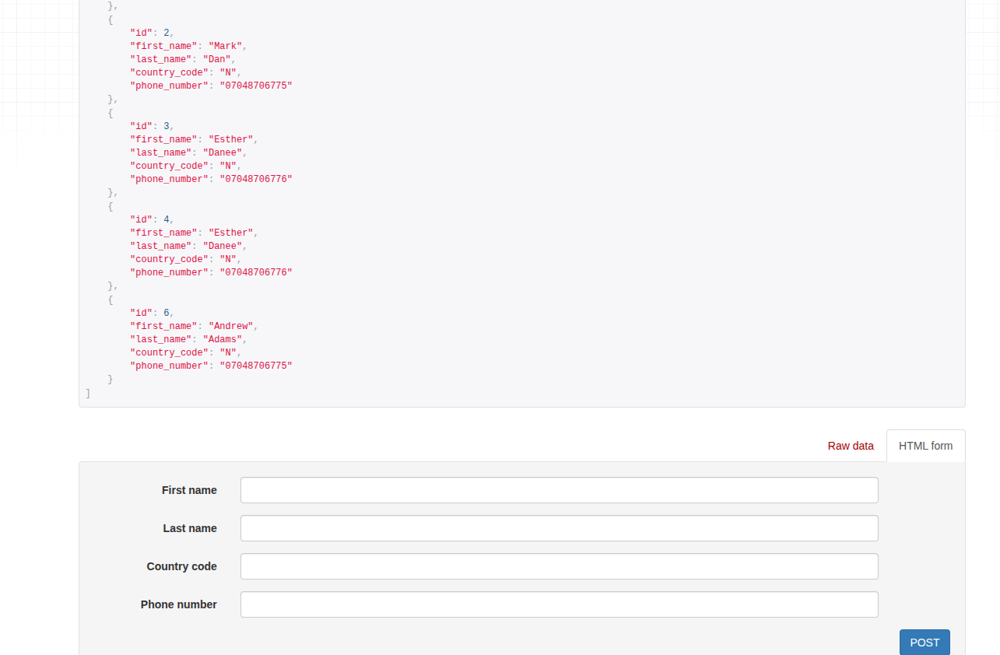
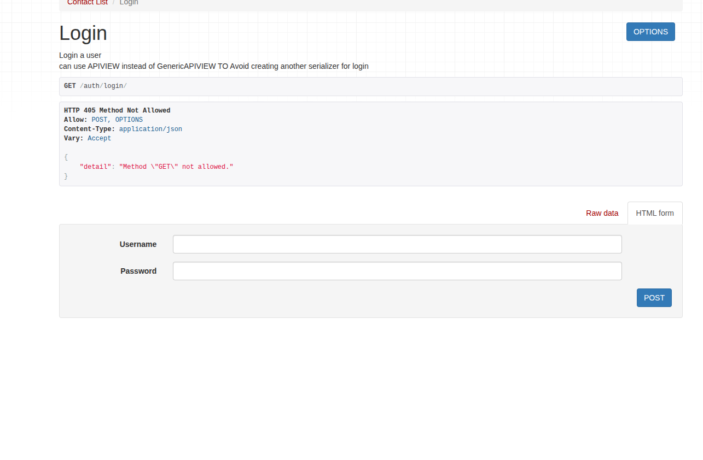

# Contact API

A simple Django REST API for managing contacts with JWT authentication.  
Each user can create and manage **only their own contacts**.

## Features
- Custom-Token-based authentication
- Create & list contacts
- User-specific data access
- Email testing with Mailpit
- Built with Django REST Framework

## Demo

- **Contacts CRUD Demo**  
  

- **API Authentication Demo**  
  

## Installation

### 1. Clone the project
```bash
git clone <your-repo-url>
cd contacts_api
2. Create & activate virtual environment
python -m venv venv
source venv/bin/activate   # Linux / Mac
venv\Scripts\activate      # Windows
3. Install dependencies
pip install -r requirements.txt
4. Environment variables
Create a .env file:

SECRET_KEY=your_django_secret
JWT_SECRET_KEY=your_jwt_secret
EMAIL_HOST=localhost
EMAIL_PORT=1025
5. Run migrations
python manage.py migrate
6. Start Mailpit (email testing)
mailpit
Mailpit UI: http://localhost:8025

7. Run the server
python manage.py runserver
Authentication
Include the token in request headers:

Authorization: Bearer <your_token>
Testing
Manual testing with Postman

Email testing via Mailpit